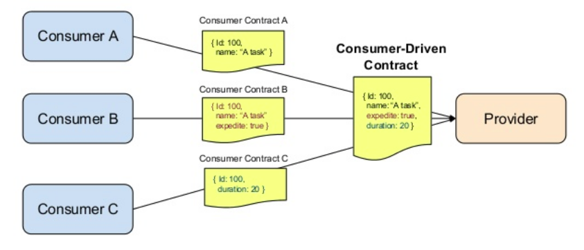

= Consumer Driven Contract Testing

=== Contract Testing
Contract testing is a way to ensure that services (such as an API provider and a client) can communicate with each other. Without contract testing, the only way to know that services can communicate is by using expensive and brittle integration tests.

Contract testing is immediately applicable anywhere where you have two services that need to communicate – such as an API client and a web front-end. Although a single client and a single service is a common use case, contract testing really shines in an environment with many services (as is common for a microservice architecture). Having well-formed contract tests makes it easy for developers to avoid version hell.

In general, a contract is between a consumer (for example, a client that wants to receive some data) and a provider (for example, an API on a server that provides the data the client needs).

=== Consumer Driven Contract (CDC) Testing
Consumer Driven Contract (CDC) is a pattern that drives the development of the Provider from it’s Consumer point of view. It is a TDD for services.

They do not test the behavior of the service in depth but that the inputs and outputs of service calls contain required attributes.

=== Advantages of Consumer Driven Contracts

You (or your team/organization/partner organization) control the development of both the consumer and the provider.
The requirements of the consumer(s) are going to be used to drive the features of the provider.

=== Consumer Driven Contracts Testing Tools

. Pact – You can find an example of consumer driven contracts testing using Pact on the Post .
. Spring Cloud Contract

