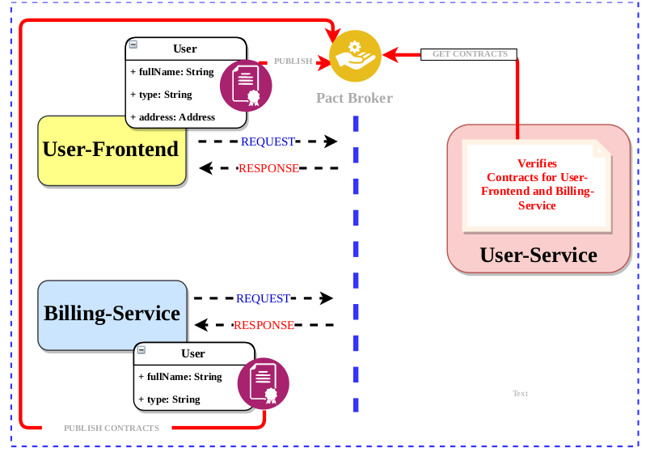

= Consumer Driven Contract Testing using Pact

=== Pact

To get started with Pact, you need to install the relevant pact components,
you can find instruction guides on the https://docs.pact.io/implementation-guides[documentation page].

=== An example scenario

Here we have an example describing Pact tests between a consumer (the Billing Service)
and its provider (the User Service).

=== REFERENCES

* https://github.com/DiUS/pact-jvm/tree/master/pact-jvm-provider-maven

